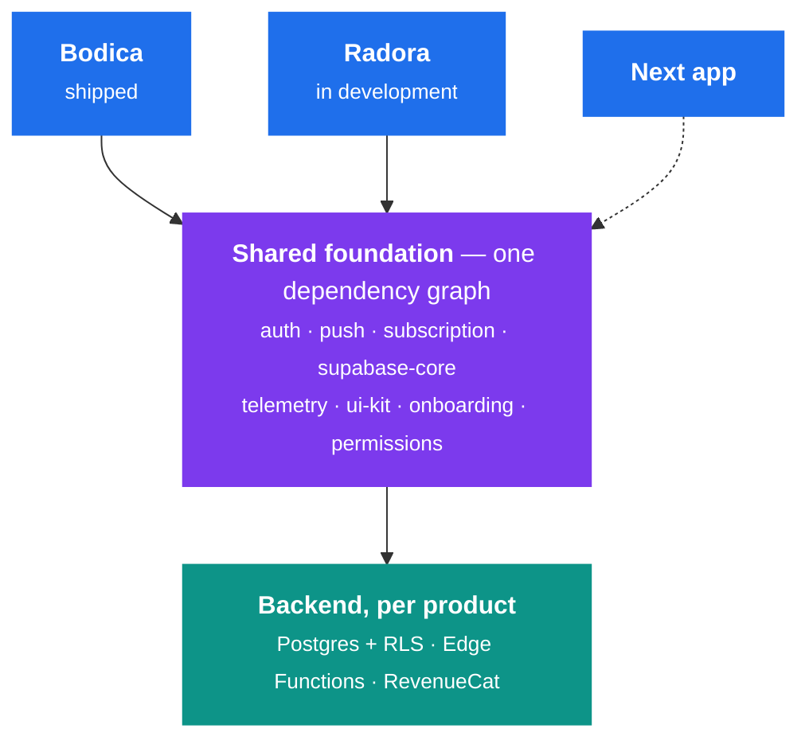

# Anıl Bürcü

**Full-stack mobile engineer.** Founder of [icodex studio](https://icodex.dev).

I build mobile apps and own them after launch — Postgres schema, serverless backend,
native auth, billing, the React Native layer, and the store release process.

[**icodex.dev**](https://icodex.dev) · [**anl@icodex.dev**](mailto:anl@icodex.dev) · [**LinkedIn**](https://www.linkedin.com/in/anil-burcu/)

---

## Shipped

### Bodica &nbsp;·&nbsp; live on the App Store and Google Play

Teaches people to read body language through lessons, quizzes, and AI photo analysis.

Photos are analyzed by a Supabase Edge Function calling Gemini, so keys and prompts never reach the client. Each request is keyed on `(user_id, request_id)`, which makes retries free — a backgrounded app or a dropped response returns the stored result instead of re-charging quota. Sign-in runs natively through Apple, Google, or email OTP with no browser redirect; tokens live in hardware-encrypted storage and refresh is serialized behind a mutex. Billing is the most defended part: the paywall runs a preflight conflict check before Apple or Google billing is ever triggered, subscription transfers require server-side proof rather than a client claim, and a monotonic event gate stops a late webhook retry from clobbering fresher state.

`React Native` `Expo` `TypeScript` `Supabase` `Gemini` `RevenueCat` `Sentry` `PostHog`

[App Store](https://apps.apple.com/app/id6756843038) · [Google Play](https://play.google.com/store/apps/details?id=com.anilburcu.readbody) · [**Architecture notes →**](https://github.com/AnilBurcu/Body-Language-Showcase)

### Radora &nbsp;·&nbsp; in development

Learn English by reading, rather than by drilling word lists in isolation.

The study engine is a pure state machine with no imports: one scheduled queue where answering a word re-inserts it at a variable distance ahead, so repetitions expand as you get them right and a missed word comes back sooner. All of its jitter comes from a seeded PRNG, which keeps the reducer deterministic and unit-testable without mocks. Long-term scheduling is server-authoritative — Postgres decides mastery and the next review date, so a word can't be farmed to "mastered" in one sitting. Failed writes land in idempotent MMKV queues and drain on reconnect. Premium content is filtered by Row Level Security rather than a client-side check.

`React Native` `Expo` `TypeScript` `Supabase` `Zustand` `TanStack Query` `RevenueCat`

[**Architecture notes →**](https://github.com/AnilBurcu/Radora-Showcase)

## How I build

Most of my thinking goes into architecture. I use a feature-first structure — each domain module owns its components, hooks, API layer, and state — so modules share one shape and stay navigable as the codebase grows. Auth, storage, observability, and privacy live in a core layer behind explicit contracts.

The packages above hold one hard rule: **no package depends on another package's tables.** `push` doesn't know about `auth`; `subscription` doesn't know about `push`. They all reference `auth.users` and nothing else. That constraint is what makes the second app cheap to start and the third one cheaper.

Three principles I keep coming back to:

- **The server decides, the client reconciles.** Scheduling, quotas, XP, and entitlement are computed in Postgres. The client sends intent and applies the answer. Anything a tampered build could lie about doesn't get to be authoritative.
- **Idempotency before retry.** Every write that might be replayed was designed to be replay-safe first — which is what makes an aggressive retry policy affordable instead of dangerous.
- **Failure modes are chosen, not discovered.** Quota exhaustion clamps rather than blocks. Realtime degrades to a stale-time refresh. Stale queued writes expire instead of resurrecting. Each is a decision written down where the code lives.

I care about making the next change cheap.

## Stack

| | |
| --- | --- |
| **Mobile** | React Native, Expo (EAS), TypeScript, Hermes, New Architecture, Swift, UIKit |
| **State & data** | Zustand, TanStack Query, react-native-mmkv |
| **Backend** | Supabase (Postgres, RLS, Edge Functions), Node.js, Express, MongoDB |
| **Auth & payments** | Apple Sign-In, Google Sign-In, OAuth, RevenueCat, StoreKit 2 |
| **Observability** | Sentry with PII scrubbing, PostHog (EU-hosted, consent-gated) |
| **Web** | React, Next.js, TypeScript, Tailwind CSS |

## Work with me

icodex studio takes a small number of client projects: mobile apps built with React Native, Expo, and Supabase — from schema design through store release. If you want the whole stack owned by one person, get in touch.

[**anl@icodex.dev**](mailto:anl@icodex.dev) · [**icodex.dev**](https://icodex.dev)
