Full-stack mobile engineer. Founder of [icodex studio](https://icodex.dev).

I build mobile apps and run them after launch: Postgres schema, serverless backend, native auth, payments, the React Native layer and the store release process. Built solo, end to end.

[Portfolio](https://icodex.dev) · [Email](mailto:anl@icodex.dev) · [LinkedIn](https://www.linkedin.com/in/anil-burcu/)

## Apps

### Bodica &nbsp;·&nbsp; live on the App Store and Google Play

Bodica teaches body language through structured lessons, quizzes and AI photo analysis. Photos are analyzed by a Supabase Edge Function that calls Gemini, so keys and prompts never reach the client. Users sign in with Apple, Google or email OTP, tokens live in hardware-encrypted storage, and token refresh is serialized behind a mutex. Subscriptions run through RevenueCat on StoreKit 2 with server-side webhook validation, push notifications use actionable categories, and analytics only run after GDPR consent.

`React Native` · `Expo` · `TypeScript` · `Supabase` · `Gemini` · `RevenueCat` · `Sentry` · `PostHog`

[App Store](https://apps.apple.com/app/id6756843038) · [Google Play](https://play.google.com/store/apps/details?id=com.anilburcu.readbody) · [Architecture notes](https://github.com/AnilBurcu/Body-Language-Showcase)

### Radora &nbsp;·&nbsp; in development

Radora helps you learn English by reading. A spaced repetition engine schedules every word server-side, so progress is decided by the backend rather than the client, with XP, levels and streaks on top. The data layer is local-first: screens render from cache on cold start, and writes that fail on a bad network replay when it comes back. Premium content is gated by Row Level Security rather than a client-side check. Localized in English, Spanish and Turkish, with a Next.js admin panel on Vercel.

`React Native` · `Expo` · `TypeScript` · `Supabase` · `Zustand` · `TanStack Query` · `RevenueCat`

[Architecture notes](https://github.com/AnilBurcu/Radora-Showcase)

## Stack

- **Mobile:** React Native, Expo (EAS), TypeScript, Hermes, New Architecture, Swift, UIKit
- **State and data:** Zustand, TanStack Query, react-native-mmkv
- **Backend:** Supabase (Postgres, RLS, Edge Functions), Node.js, Express, MongoDB
- **Auth and payments:** Apple Sign-In, Google Sign-In, OAuth, RevenueCat, StoreKit 2
- **Monitoring:** Sentry with PII scrubbing, PostHog (EU-hosted, consent-gated)
- **Web:** React, Next.js, TypeScript, Tailwind CSS

## Work with me

icodex studio takes a small number of client projects: mobile apps built with React Native, Expo and Supabase, from schema design to store release. If you need the whole stack owned by one person, write to me.

[anl@icodex.dev](mailto:anl@icodex.dev) · [icodex.dev](https://icodex.dev)

---

